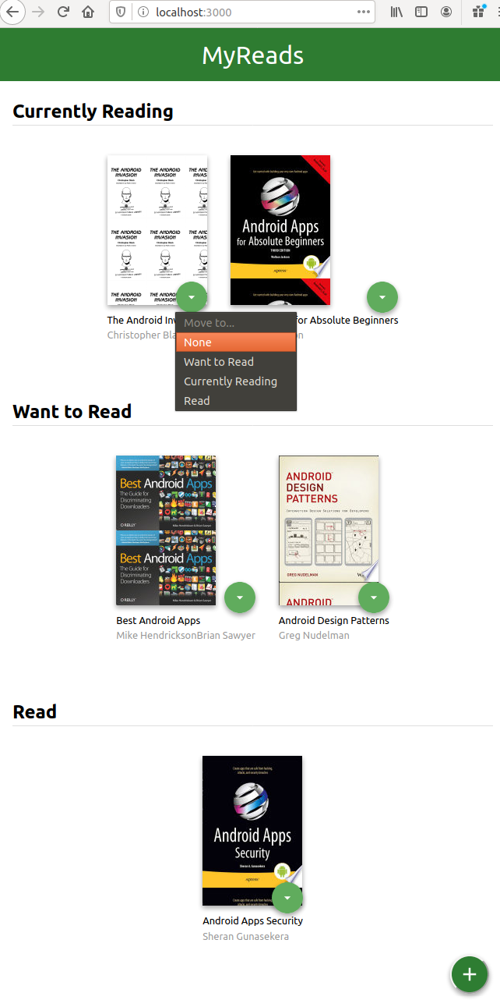
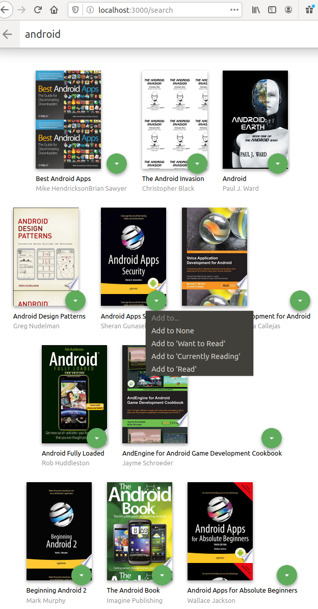

# MyReads Project

## What is this? 

This simple book shelf app is a project of Udacity React Nanodegree.

This appls does: 
- showing books in different shelves
- moveing books among shelves
- adding new books to shelves

## Setup

- clone this repo
- `cd myreads`
- `npm install`
- `npm start`
- access to `localhost:3000` on web browser